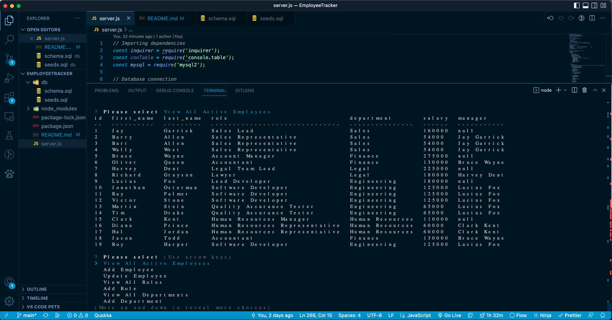

# EmployeeTracker
  

  ## Table of Contents
  *[Description](#description)  
  *[Installation](#Installation)  
  *[Usage](#usage)  
  *[Contribution](#contribution)  
  *[Tests](#tests)  
  *[Questions](#questions)  
  *[Credits](#credits)  

  ## Description 
  This application was built to keep track of employees for a company's roster. It keeps track of departments, salary, manager and their role in the company as well. If your company grows to where you need new roles as well as departments, we have that covered for you! 

  ## Installation 
  I installed inquirer and mysql2 for this project to work. A user would need node to have the application to start. 

  ## Usage 
  The application will start with a list of choices going over adding employees, departments, and roles. You can also view departments, roles as well as employees. If there is an employee that changed roles, you can make adjustments under the "Update Employee" choice to get that settled. 
  

  ## Licenses 
  
  This project is using the MIT license. To learn more, please click the license link listed above.

  ## Contribution 
  I had to get lessons to learn how to reference from within a list.  I referenced out lessons in class for overall SQL syntax. 

  ## Tests 
  No formal tests conducted. 

  ## Questions 
  Have any questions regarding this project?  
  Send me a message on...  
  Github: https://github.com/gabe-velasquez  
  Email: gabriel.velasquez0116@gmail.com  

  ## Credits 
  Gabe Velasquez
